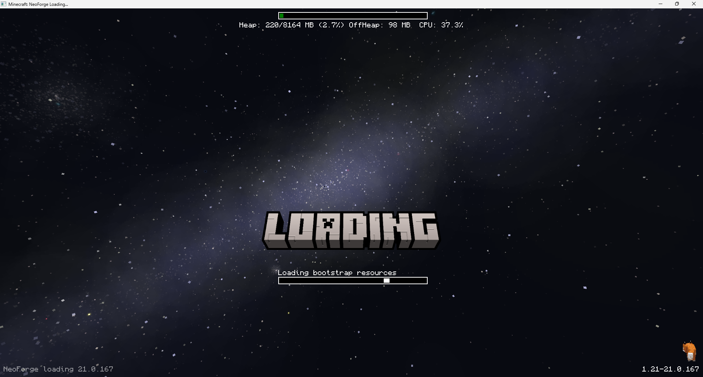

# Simple Custom Early Loading

<a href="https://www.curseforge.com/minecraft/mc-mods/simple-custom-early-loading" target="_blank"></a>
<a href="https://modrinth.com/mod/simple-custom-early-loading" target="_blank"></a>

This _mod_ allows the customization of Neoforge's early loading screen.



Only static images are supported.  
Currently, the window is not able to dynamically change its resolution when the window is resized.  
I won't allow removing the Mojang logo.

## Features:

- add and position **custom images** (png)
- toggle and change the position of the progress bar
- toggle performance bar
- toggle NeoForge's fox
- toggle bottom left log
- toggle NeoForge's version (bottom right)

## Installation:

1. place the jar in the mods folder
2. modify the `config/fml.toml` file

```toml
# Early window provider
earlyWindowProvider = "SimpleCustomEarlyLoading"
# ... Other options ...
# Optionally set the window to be maximized
earlyWindowMaximized = true
```

## Configuration:

Place your images in the `config/simple_custom_early_loading` folder.

Then you can edit the configuration file `config/simple-custom-early-loading.json`.  
You can find default
config [here](https://github.com/lukaskabc/SimpleCustomEarlyLoading/blob/main/src/main/resources/default_config.json).

In the configuration you can specify elements.
Each element is one static image.
You need to specify the type of coordinates (`absolute` or `percentage`).
Note that the image size might be different on different displays, so you probably want to use percentage.

Percentage values should be from range [0; 100].
You need to specify coordinates for two corners of the image (top left and bottom right).

The default config contains an example of background (stretched to the whole window) -
it is a screenshot from the game with the [stellarview](https://github.com/Povstalec/StellarView) mod.  
Second element is an image created with [BlockBench](https://www.blockbench.net/)
with [text generator plugin](https://www.blockbench.net/plugins/mc_text_generator).

The image size is 654x152 pixels.
Assuming the window size is FullHD 1920x1080, then one percentage for that is 1920/100 = 19.2 and 1080/100 = 10.8.
Then the size of the image scaled to 75% in percentage is `654 * 0.75 / 19.2 = 25.55` and `152 * 0.75 / 10.8 = 10.55`.
X coordinates: Image positioned in the middle (50%) has coordinates from `50 - 25.55 / 2 = 37.225` (x1) to
`50 + 25.55 / 2 = 62.775` (x2).
Y coordinates: Image position at 55% from the top has coordinates from `55` (y1) to `55 + 10.55 = 65.55` (y2).

# Development

This is a simplified version of [StargateEarlyLoading mod](https://github.com/lukaskabc/StargateEarlyLoading).

If you are interested in some implementation details,
see [implementation description of StargateEarlyLoading](https://github.com/lukaskabc/StargateEarlyLoading/blob/main/docs/implementation.md).

___

NOT AN OFFICIAL MINECRAFT PRODUCT/SERVICE/MOD. NOT APPROVED BY OR ASSOCIATED WITH MOJANG OR MICROSOFT
